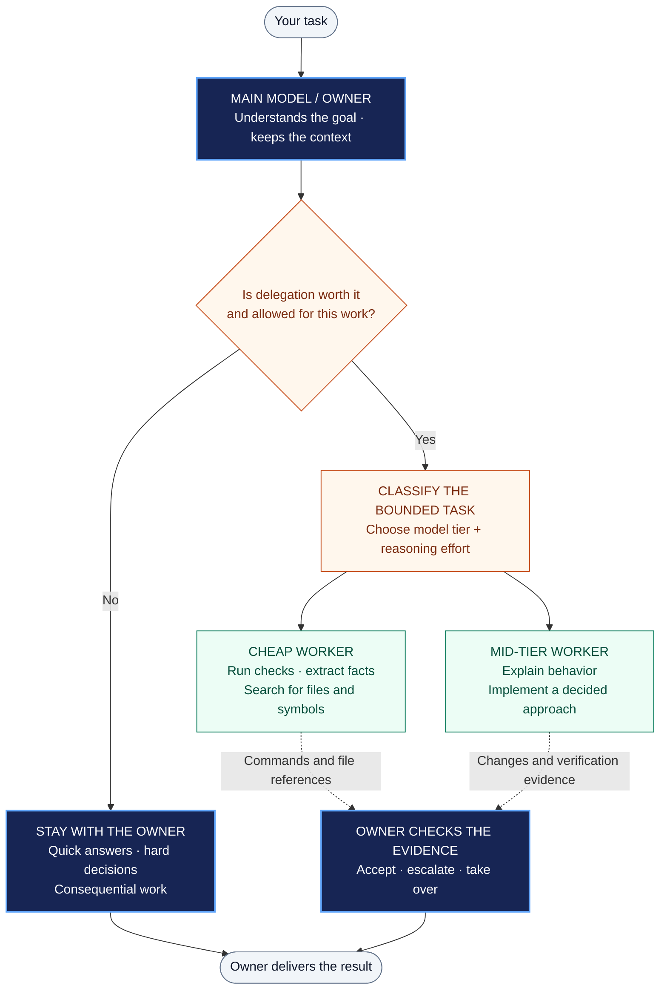

<h1 align="center">efficiency-skill</h1>

<p align="center"><strong>Keep the judgment. Delegate the grind.</strong></p>

<p align="center">
  <a href="#one-line-install">Install</a> ·
  <a href="#how-it-works">How it works</a> ·
  <a href="#try-it">Try it</a> ·
  <a href="efficiency-skill/SKILL.md">Skill source</a> ·
  <a href="evals/RESULTS-2026-09.md">Evidence</a> ·
  <a href="CHANGELOG.md">Changelog</a>
</p>

Your main model stays in charge. Smaller models handle bounded work. Hard decisions stay with the owner.

`efficiency-skill` is a portable Agent Skill for choosing when to delegate, which model tier to use, and how much reasoning effort a task needs. It aims to reduce unnecessary spend while preserving quality, and keeps work inline when delegation would add more overhead than value.

Works with Claude Code, Codex, and other harnesses that load `SKILL.md`. Model and effort controls depend on the host; loading the skill alone does not add those capabilities.

## One-Line Install

```bash
npx skills@latest add AaravKashyap12/efficiency-skill --skill efficiency-skill
```

Requires Node.js 22.20.0 or newer and npm (the requirement reported by skills 1.7.0). The [open skills installer](https://github.com/vercel-labs/skills) fetches this repository and selects only `efficiency-skill`. Follow its prompts to choose your agent and installation scope. Add `-g` for a global installation.

Then ask your agent to use `efficiency-skill` for the task.

## How It Works

The main model is the parent: it decides what to delegate, sets the brief, checks the evidence, and owns the final result. These branches are routing options, not a requirement to launch several workers.



The session model stays fixed. Workers receive self-contained briefs and return compact evidence. No recursive reviewer agents; the owner verifies the work.

## Use It When

- You are spending frontier-model tokens on test output, file discovery, or repetitive work.
- A task mixes straightforward execution with decisions that need the main model.
- You want explicit model and effort choices instead of treating every task the same.
- You want delegation to earn its overhead, with clear boundaries and evidence.

## Try It

```text
Use efficiency-skill for this task. Keep architecture and final review with
the main model. Delegate only bounded work that is worth the overhead.
```

```text
Use efficiency-skill to investigate this repo. Use a cheap worker to locate
the relevant files; keep interpretation and the implementation plan with the owner.
```

```text
Use efficiency-skill with lean-engineering. Keep code ownership with the
main agent and delegate focused test execution when the harness supports it.
```

These are usage examples, not measured savings claims.

## The Routing Rules

The skill applies a delegation gate before choosing a tier. Short answers, work already in context, and decisions that need the whole conversation stay inline.

| Task class | Examples | Minimum tier | Default effort |
| --- | --- | --- | --- |
| Mechanical | Run tests, summarize logs, extract structured facts | Cheap | Low |
| Breadth reconnaissance | Locate files, list imports, trace a checkable chain | Cheap | Low |
| Judgment reconnaissance | Explain behavior, inspect retries, audit API usage | Mid | Low or medium |
| Implementation | Build a bounded change with an agreed approach | Mid | Medium |
| Hard reasoning | Ambiguous debugging, architecture, novel algorithms | Session model | High |
| Consequential | Security, money, migrations, concurrency, public contracts | Session model | High |

Model tier and reasoning effort are separate controls. Tiers are relative to the session model and the provider's verified offerings. When the host cannot select worker models, the skill uses effort controls where available; if neither is controllable, it works inline.

The [runtime skill](efficiency-skill/SKILL.md) is the source of truth for classification, escalation, ownership, and verification rules. Its [provider references](efficiency-skill/references/) record official sources and review dates; model IDs and prices must be rechecked when those references become stale.

## What Stays With the Owner

- User dialogue, authorization, and decisions spanning the conversation.
- Hard reasoning and consequential work.
- File ownership, load-bearing verification, and final review.
- Taking over when bounded escalation does not resolve a weak result.

The skill guides agent behavior. It is not a proxy that rewrites API requests, and it does not guarantee lower cost or identical quality. Requested worker settings are not proof of the model that actually ran.

## Other Install Methods

To list the skill before installing:

```bash
npx skills@latest add AaravKashyap12/efficiency-skill --list
```

From the repository root of a local clone, copy the complete `efficiency-skill/` folder, including `references/`, into your harness's skill directory:

| Harness | Destination |
| --- | --- |
| Claude Code | `~/.claude/skills/efficiency-skill/` |
| Codex | `~/.codex/skills/efficiency-skill/` |
| Other compatible agents | The directory their skill loader scans |

For hosts that accept `.skill` archives, use [dist/efficiency-skill.skill](dist/efficiency-skill.skill). It packages the 0.2.0 runtime source and provider references; its file set and bytes were verified against the source folder during release preparation.

## Results — September 2026 pre-launch

Twenty isolated Codex trials compared baseline and candidate behavior for E01, E02, E05, E09, and E12, twice per condition. Recorded outcomes: 14 PASS, 6 PARTIAL, 0 FAIL. See the [case records and interpretation](evals/RESULTS-2026-09.md) and [CSV](evals/results-2026-09.csv); PARTIAL is not a full acceptance pass.

Both routed E02 runs needed a follow-up after initially discovering zero tests. Worker model/effort overrides are recorded as requested values; actual backend identities and per-run costs were not exposed. No dollar savings, cheaper-tier execution claim, or route approval is established. E05's actual answers and any silent misses remain visible in the records. The website comparisons verify artifacts and requested routing only, not cost superiority.

The originally requested Claude Code measurements remain blocked by authentication/provider failures, recorded separately. Dated provider references are unchanged. These Codex trials do not stand in for Claude Code cost measurements.

The [case definitions](evals/cases.md) describe the proof plan. A route is approved for a task class only when with-skill runs match the baseline pass rate at lower cost. The recorded trials do not establish that approval.

## Pairing With Engineering Workflows

Use an engineering workflow such as [lean-engineering](https://github.com/AaravKashyap12/lean-engineering) to govern implementation, ownership, and completion. Efficiency governs whether to dispatch, the model tier, and the reasoning effort. The engineering workflow's owner-only boundaries remain binding.

## Repository Layout

```text
efficiency-skill/
  SKILL.md                 Portable routing contract
  references/              Dated provider guidance and official sources
dist/
  efficiency-skill.skill   Packaged runtime skill
evals/                     Cases, fixtures, runbook, and recorded evidence
CHANGELOG.md               Release history
LICENSE                    MIT license
```

## Contributing

Useful contributions include reproducible routing mistakes, provider-reference corrections backed by official sources, and measurements that report quality alongside total cost. Keep requested model settings separate from confirmed execution evidence.

## License

[MIT](LICENSE) · Built by [Aarav Kashyap](https://github.com/AaravKashyap12).
